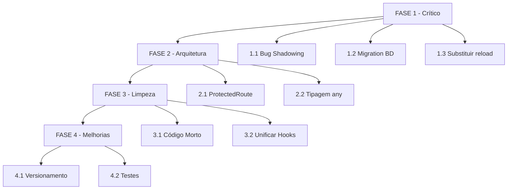

# Plano de Melhorias - Sistema SBMIBZ

## 📋 Visão Geral

Este documento apresenta o plano estruturado para as primeiras mudanças necessárias no sistema SBMIBZ, priorizadas por criticidade e impacto.

---

## 🚨 FASE 1: Correções Críticas (IMEDIATO)

### 1.1 Bug: Shadowing em useVersionTracker

**Problema**: Linha 33 em `src/hooks/useVersionTracker.ts` sobrescreve a função importada, causando loop infinito.

```typescript
// PROBLEMA:
const resetVersion = useCallback(() => {
  const newVersion = resetVersion(); // ← chama a si mesmo!
  return newVersion;
}, []);
```

**Solução**: Renomear para `handleResetVersion`.

### 1.2 Executar Migration do Banco

**Problema**: Status `embarque_cancelado` e `coleta_cancelada` foram removidos do frontend mas não do banco.

**Solução**: Executar `supabase/migrations/20260222000000_add_cancelled_statuses.sql`

### 1.3 Substituir window.location.reload()

**Problema**: Uso de `window.location.reload()` no logout causa perda de estado React.

**Arquivos afetados**:
- `src/pages/Configuracoes.tsx` (linhas 39-40)

**Solução**: Usar função `logout()` do AuthContext.

---

## ⚠️ FASE 2: Correções de Segurança e Arquitetura

### 2.1 ProtectedRoute - Evitar Loading Infinito

**Problema**: `useRTs()` é chamado antes da autenticação, pode causar queries desnecessárias.

```typescript
// PROBLEMA em ProtectedRoute.tsx:12
const { agentes } = useRTs(); // executa query desnecessária
```

**Solução**: Passar `agentes` como prop ou usar contexto compartilhado.

### 2.2 Tipagem - Remover `any`

**Problema**: Uso de `any` em `useRTMutations.ts` (linhas 68, 90).

**Solução**: Definir tipos genéricos para as mutações.

---

## 📦 FASE 3: Limpeza de Código

### 3.1 Remover Código Morto

| Arquivo | Ação |
|---------|------|
| `src/hooks/useRTNew.ts` | Remover ou integrar |
| `src/pages/ConfiguracoesRefactored.tsx` | Remover ou integrar |
| `src/components/configuracoes/` | Decidir se usa ou remove |
| `src/components/TableSkeleton.tsx` | Verificar se shadcn jásuporta |

### 3.2 Unificar hooks de paginação

Dois hooks com lógica similar:
- `src/hooks/usePagination.ts` (genérico)
- `src/hooks/usePaginatedRTs.ts` (específico RT)

**Solução**: Manter apenas `usePagination` genérico.

---

## 🔄 FASE 4: Melhorias de Arquitetura Futuras

### 4.1 Sistema de Versionamento

**Problema atual**: localStorage com contador pode causar inconsistências.

**Sugestão**: Usar versão semântica tradicional com build number.

### 4.2 Testes

Adicionar Jest/Testing Library para:
- Componentes críticos (RTForm, RTTable)
- Hooks (useRTs, useAuth)

---

## 📊 Diagrama de Priorização



---

## ✅ Checklist de Implementação

### Fase 1 (Imediato)
- [ ] Corrigir shadowing em useVersionTracker
- [ ] Executar migration de statuses cancelados
- [ ] Substituir window.location.reload()

### Fase 2 (Curto prazo)
- [ ] Refatorar ProtectedRoute
- [ ] Corrigir tipagem any

### Fase 3 (Médio prazo)
- [ ] Decidir destino código morto
- [ ] Unificar hooks paginação

### Fase 4 (Longo prazo)
- [ ] Implementar testes
- [ ] Melhorar versionamento

---

## 📁 Arquivos de Referência

- **Migration**: `supabase/migrations/20260222000000_add_cancelled_statuses.sql`
- **Hooks Problemáticos**: 
  - `src/hooks/useVersionTracker.ts`
  - `src/hooks/useRTNew.ts`
- **Componentes de Auth**:
  - `src/contexts/AuthContext.tsx`
  - `src/components/LoginScreen.tsx`
  - `src/components/ProtectedRoute.tsx`

---

*Plano gerado em: 2026-02-22*
*Versão: 1.0*
